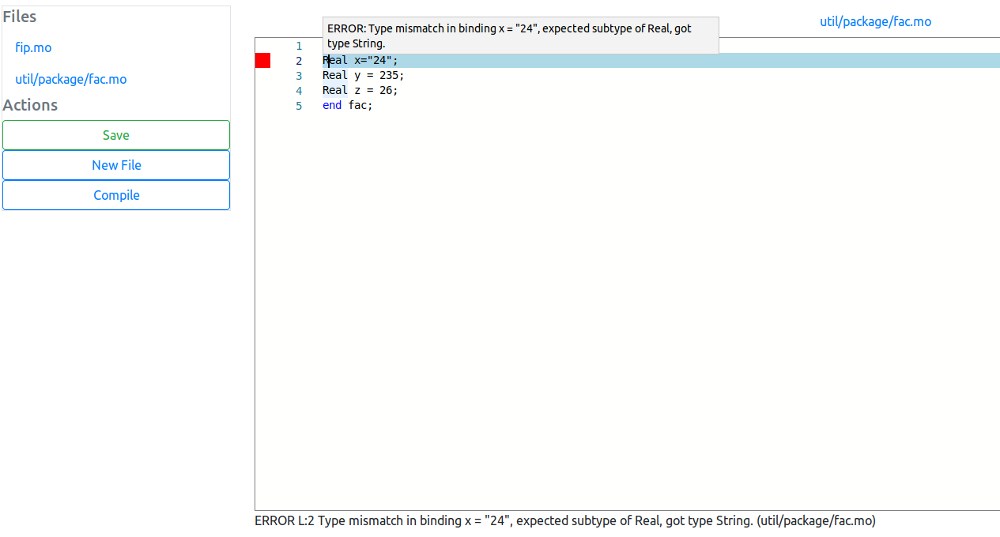

= Webmodelica

A web-based Modelica-Toolbox.

=== Docker
The backend, frontend and MoPE server are published as docker containers to https://cloud.docker.com/u/thmmote/repository/list[DockerHub]:

- https://cloud.docker.com/u/thmmote/repository/docker/thmmote/webmodelica[backend]
- https://cloud.docker.com/u/thmmote/repository/docker/thmmote/webmodelica-ui[frontend]
- https://cloud.docker.com/u/thmmote/repository/docker/thmmote/mope-server[mope]

Starting a production deployment should be as simple as:

- Setup
[source,sh]
----
# create data directories and set permissions
$ mkdir -p private/data
$ chown 777 private/data
----

- Running
[source, sh]
----
$ docker-compose --project-name webmodelica -f deployment/docker-compose.yml -f deployment/docker-compose.prod.yml up
----
Now you can access the frontend at `localhost:80`.

- Viewing the development database
You can access the database via mongoshell by logging into the corresponding mongo container:
[source,sh]
----
$ docker container exec -it <container name> mongo <database name>
$ docker container exec -it deployment_mongo_1 mongo wm-dev
----
