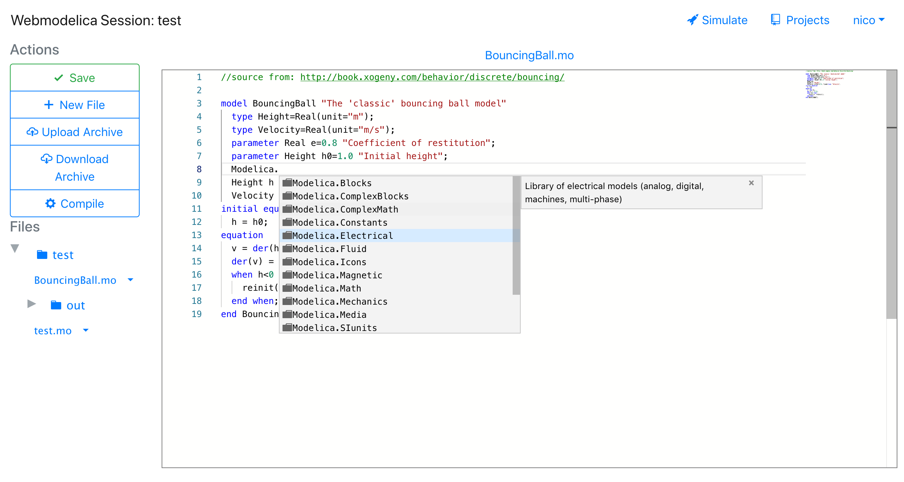

= Webmodelica
//configure admonitions for processing by GitHub
ifdef::env-github[]
:tip-caption: :bulb:
:note-caption: :information_source:
:important-caption: :heavy_exclamation_mark:
:caution-caption: :fire:
:warning-caption: :warning:
endif::[]

A web-based Modelica-Toolbox.

== Docker
The backend, frontend and MoPE server are published as docker containers to https://hub.docker.com/u/thmmote[DockerHub]:

- https://hub.docker.com/r/thmmote/webmodelica[backend]
- https://hub.docker.com/r/thmmote/webmodelica-ui[frontend]
- https://hub.docker.com/r/thmmote/mope-server[mope]

Starting a production deployment should be as simple as:

- Setup authentication providers by copying the `auth-svc.settings.sample.yml` file:

[source,sh]
----
$ cp deployment/config/auth-svc.settings.sample.yml deployment/config/auth-svc.settings.yml
----

setup your providers as needed, the *developer login* is enabled by default.

- Running
+
[source, sh]
----
$ docker-compose --project-name wm -f deployment/docker-compose.yml -f deployment/docker-compose.prod.yml up
----

Now you can access the frontend at `localhost:80`.

- Viewing the development database: You can access the database via mongoshell by logging into the corresponding mongo container:

[source,sh]
----
$ docker container exec -it <container name> mongo <database name>
$ docker container exec -it deployment_mongo_1 mongo wm-dev
----

== Developer Documentation

TIP: setting up a development environment is described here:
      link:doc/readme.adoc[Development Setup]

The developer documentation is available in _doc/_.
You can generate a html file using asciidoctor.js:

[source, sh]
----
$ cd ui
$ npm run generate-doc
----

The resulting documentation is available at `ui/public/documentation.html`.

TIP: the documentation is also generated during deployment and available at https://staging-webmodelica.mni.thm.de/documentation.html[staging-webmodelica].

== API Documentation

The API documentation is written using https://raml.org/developers/raml-100-tutorial[RAML] and available in _doc/api/api.raml_.
You can generate a html file by running:

[source, sh]
----
$ cd ui
$ npm run generate-doc
----

The resulting documentation is available at `ui/public/api.html`.

Type declarations and examples - available in `doc/api/types.raml` - are generated in the subproject _schema-generator/_.
This project uses Avro4s to generate https://json-schema.org/[JSON Schema] definitions from the provided Scala case classes.
The generator is in `schema-generator/src/webmodelica/SchemaGenerator.scala`, you can execute it using: `$ sbt run schemaGenerator/run`.
